# IBM APM plugin for Grafana

Author: Rafal Szypulka 

Contact: rafal.szypulka@pl.ibm.com

Revision: 0.8


**What's new:**

- 0.8
  - Added support for string metrics, thx [@lcollin](https://github.com/lcollin)
  - Added example dashboard for Node.js application running in IBM Cloud Private.
  - Simplified installation for Grafana 5. Plugin works correctly without any modifications in Grafana 5 backend. See updated installation instructions and datasource configuration for details.

- 0.7
  - Fixed compatibility issue with Grafana 4.6
  - More readible dropdown lists in panel query editor. 
- 0.6
  -  Added datasource configuration option to deallocate dataset on ITM/APM server after every metric query. It is highly recommended to have it enabled all the time. Lack of datasource deallocation requests may cause memory leak and OutOfMemory exceptions on ITM/APM server. This plugin update requires also change in the Grafana server backend. See updated installation instructions and datasource configuration for details.
- 0.4
  -  Better error handling.
  -  Cosmetic changes in the panel query editor.
  -  UTC time zone offset option for ITMv6 HUB TEMS in the datasource configuration. Change the default settings only if HUB TEMS is located in non UTC time zone **and** you access Grafana dashboard from the timezone different than your HUB TEMS - in that case set UTC offset to HUB TEMS time zone.
- 0.3 
  - New field **Time Range** in the panel query editor. If set to **Current value**, then panel query will ignore global dashboard time filter and show only the current value of the metric. Use it only for singlestat and table panels. 

Contents 
========

[**1. Introduction**](#introduction)

[**2. Demo environment**](#demo-environment)

[**3. Example dashboards**](#example-dashboards)

[**4. How to create a new panel using the IBM APM datasource**](#how-to-create-a-new-panel-using-the-ibm-apm-datasource)

[**5. Grafana installation**](#grafana-installation)

[**6. IBM APM plugin installation**](#ibm-apm-plugin-installation)

[**7. IBM APM data source configuration**](#ibm-apm-data-source-configuration)

[**8. Templating**](#templating)

[**9. Troubleshooting**](#troubleshooting)

Introduction
============

Grafana is an open source metric analytics and visualization suite. It is most commonly used for visualizing time series data for infrastructure and application analytics, but many use it in other domains including industrial sensors, home automation, weather, and process control.

Features: [*https://grafana.com/grafana*](https://grafana.com/grafana)

Basic Concepts
[*http://docs.grafana.org/guides/basic\_concepts/*](http://docs.grafana.org/guides/basic_concepts/)

Live Demo: [*http://play.grafana.org/*](http://play.grafana.org/)

Documentation: [*http://docs.grafana.org/*](http://docs.grafana.org/)

Plugins: *<https://grafana.com/plugins>* (or search for Grafana on GitHub)


IBM APM plugin adds Grafana support for:

- IBM Tivoli Monitoring 6.x and IBM Omagamon
- IBM SmartCloud Application Performance Management 7.x 
- IBM Performance Managament 8.x (only on premises version)
- IBM Cloud Application Performance Management Private

The plugin uses metrics REST API to collect data directly from APMv8 and ITMv6
and show on the Grafana dashboard.


Demo environment
===================

The live demo environment is available here: [ibm.biz/grafana-ibm-apm](http://ibm.biz/grafana-ibm-apm). User: demo. Password: demo.
Alternative URL with SSL: [ibm.biz/grafana-ibm-apm-ssl](http://ibm.biz/grafana-ibm-apm-ssl)

The live demo user has the role of **Read Only Editor** in the Grafana main organization. You can see how dashboards are configured and make
temporary changes, but you can’t save them.
If you want to create and save your dashboard, please switch to **sandbox** organization, by clicking the Grafana logo -&gt; DEMO user -&gt;
Switch to sandbox.

If you want to customize existing dashboard in the sandbox environment, copy it first by clicking  Manage Dashboard > Save as, enter a new name and then make your changes.


Example dashboards
==================

1). Sample IBM Stack monitoring dashboard with data from Linux OS, IBM HTTP Server, WebSphere Applications, WebSphere MQ, IBM DB2 and IBM Integration Bus agents:
    [*http://169.44.6.110/dashboard/db/sample-ibm-stack-monitoring?refresh=30s&orgId=1*](http://169.44.6.110/dashboard/db/sample-ibm-stack-monitoring?refresh=30s&orgId=1)
    
    
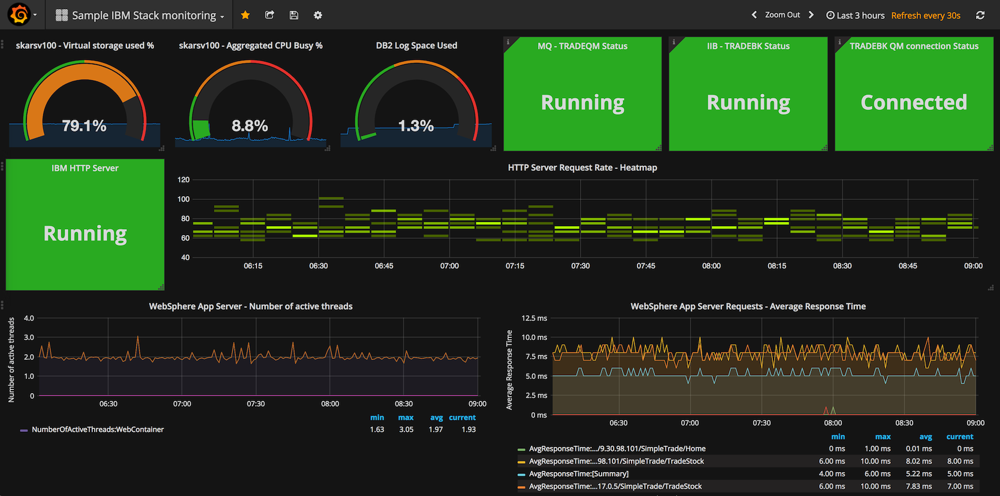


2). Linux OS dashboard with the list of agents based on Grafana template variable. Data collected from APMv8.
[*http://169.44.6.110/dashboard/db/linux-os-dashboard-ibm-performance-management-8-1-3?refresh=30s&orgId=1*](http://169.44.6.110/dashboard/db/linux-os-dashboard-ibm-performance-management-8-1-3?refresh=30s&orgId=1)

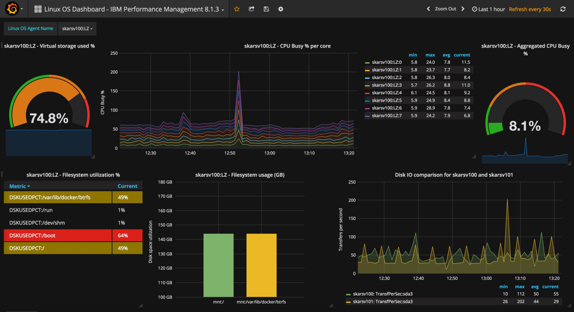

3). Linux OS dashboard with the list of agents based on Grafana template variable. Data collected from ITM 6.

[*http://169.44.6.110/dashboard/db/linux-os-dashboard-ibm-tivoli-monitoring-6-3-0-7?refresh=30s&orgId=1*](http://169.44.6.110/dashboard/db/linux-os-dashboard-ibm-tivoli-monitoring-6-3-0-7?refresh=30s&orgId=1)

It looks exatly the same as the one above, but data is collected from ITMv6.

4). Mashup of ITMv6 and APMv8 data on the same chart.

[*http://http://169.44.6.110/dashboard/db/mashup-itm63-apm813?refresh=30s&orgId=1*](http://169.44.6.110/dashboard/db/mashup-itm63-apm813?refresh=30s&orgId=1)

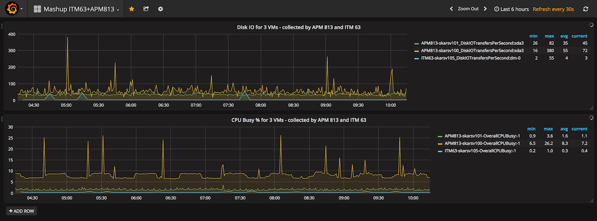

5). Repeated row example with contextual drill down to more detailed dashboard.

[*http://169.44.6.110/dashboard/db/repeated-row-based-on-template-contextual-drill-down?refresh=30s&orgId=1*](http://169.44.6.110/dashboard/db/repeated-row-based-on-template-contextual-drill-down?refresh=30s&orgId=1)

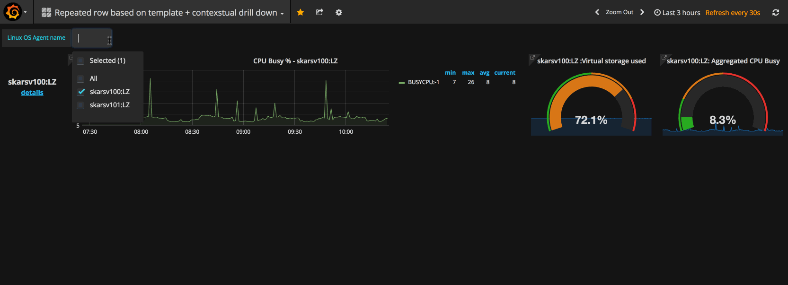

6). Sample IBM IIB monitoring dashboard.

[*http://169.44.6.110/dashboard/db/sample-iib-dashbaord?refresh=30s&orgId=1*](http://169.44.6.110/dashboard/db/sample-iib-dashbaord?refresh=30s&orgId=1)

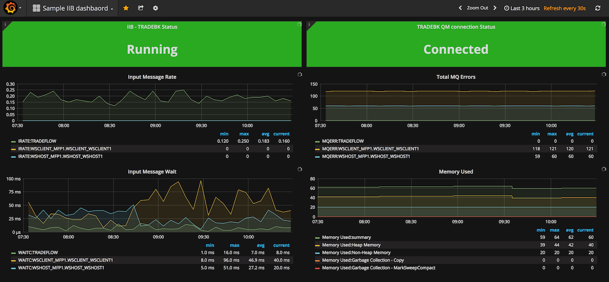

7). Transaction Volume and Response Time collected by the Web Response Time Agent.

[*http://169.44.6.110/dashboard/db/transactions-collected-by-response-time-agent?refresh=30s&orgId=1*](http://169.44.6.110/dashboard/db/transactions-collected-by-response-time-agent?refresh=30s&orgId=1)

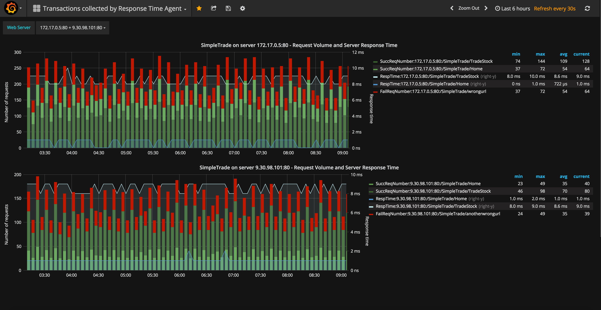

8). Simulated Transaction Volume collected the the custom agent created with the Agent Builder.

[*http://169.44.6.110/dashboard/db/simulated-transactions-volumes-monitored-by-custom-apm-agent-1?orgId=1*](http://169.44.6.110/dashboard/db/simulated-transactions-volumes-monitored-by-custom-apm-agent-1?orgId=1)

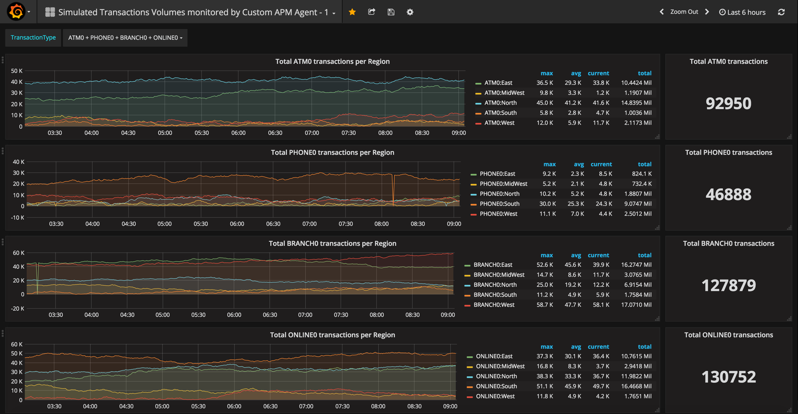

How to create a new panel using the IBM APM datasource
===============================

Follow these steps to create a sample chart showing
disk IO metric for specific disk collected from two different servers.

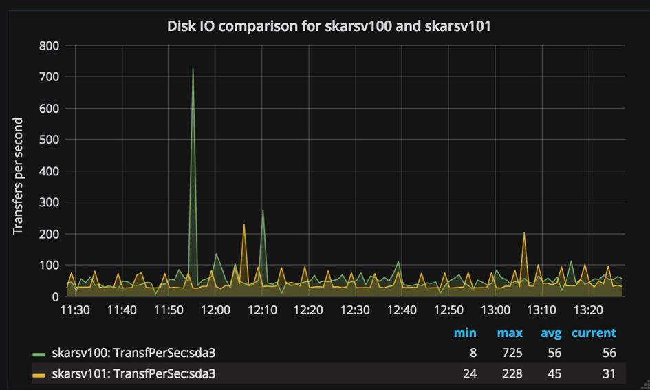

1.  Grafana logo -&gt; Dashboards -&gt; New.
2.  Drag and drop the Graph icon to the Empty Space.
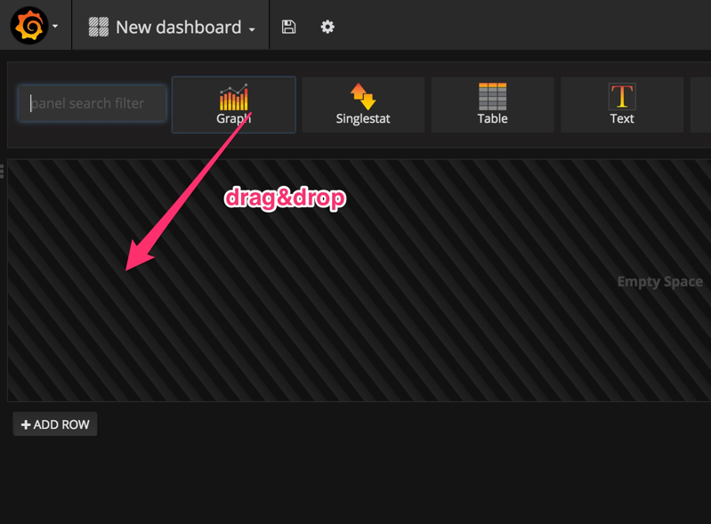
3.  Now it should look like below.
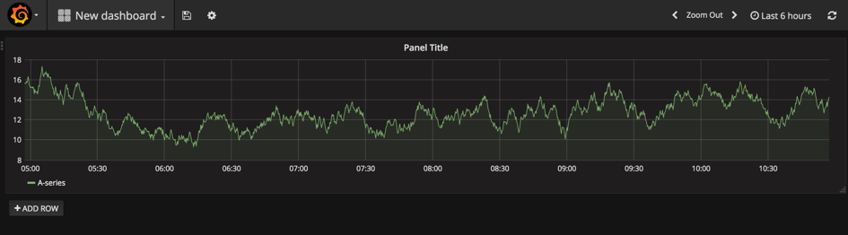
4.  Click on the **Panel Title** bar and select **Edit**.
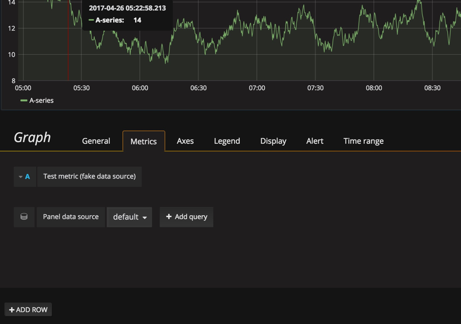
5.  Click the **Data source** list and select the APM data source. In this example it is named *APMv8.1.3*.
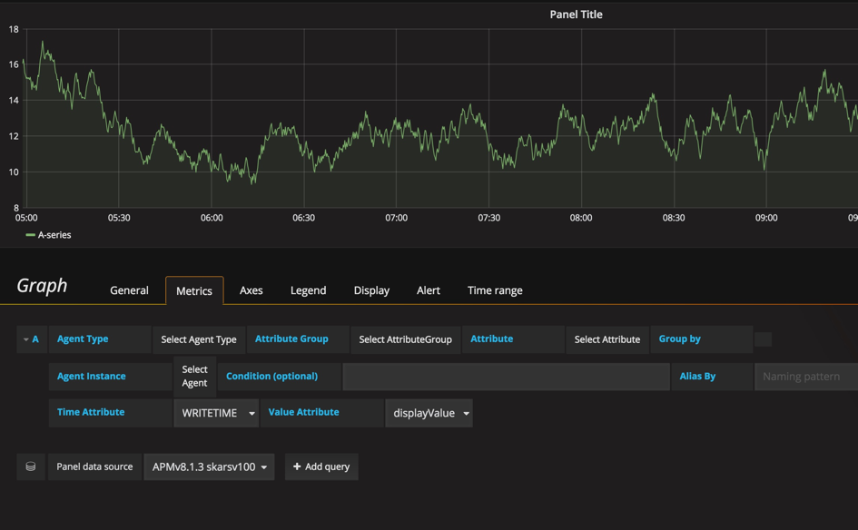
6.  Select **Agent Type** (you can type agent code or agent type name to
    search for supported agent type or scroll down a dropdown list).
    The list is built dynamically through the REST API call. If the resulting list is empty, a possible cause might be a connection problem with the APM REST API. You can easily debug it with developer tools in Chrome or Firebug in Firefox (see the
    Troubleshooting chapter at the end of this document).
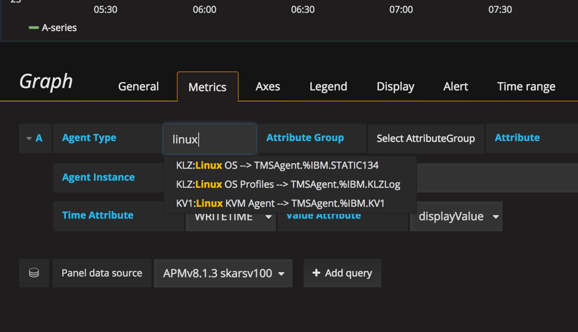
7.  Select other parameters like Attribute Group, Attribute, Group by
    (only for Attribute groups with Primary Key/Display Item) and Agent
    Instance.
8.  Condition (for filtering results) and Alias (for parameter name
    customization) are optional. Alias, if defined will replace the default
    parameter name in the legend. The default is *AttributeName:DisplayItem*.
    The alias replaces *AttributeName*.
9.  The result should be similar to the one below.
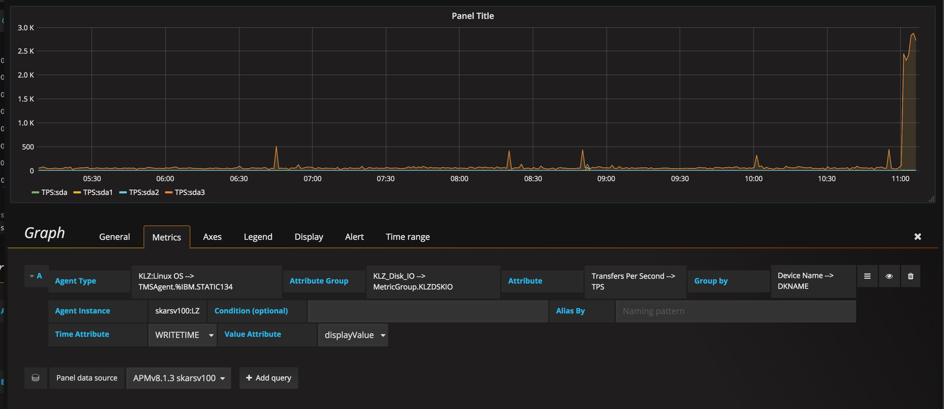
10.  In this example we want to draw data from two different agents on the
    same line chart. Click **+Add query**, to add a query from another agent
    and select the attribute the same way as above. The result should be similar
    to the one below.
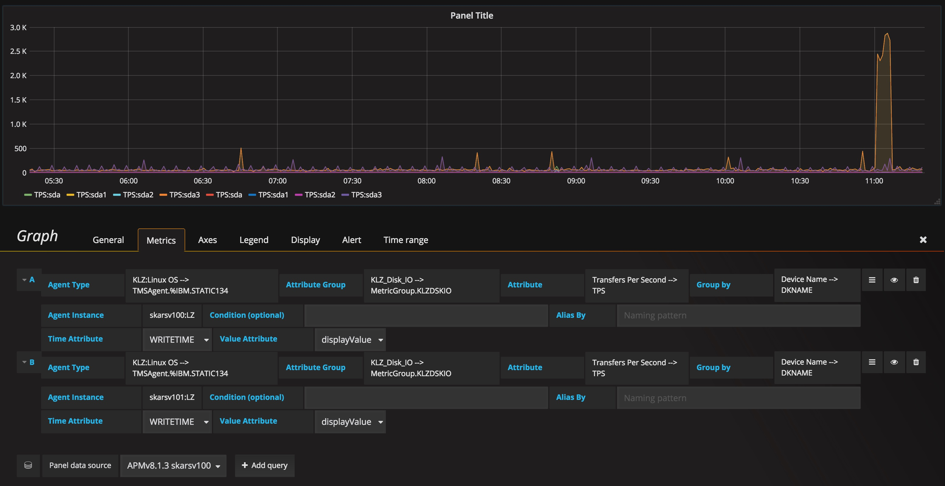
11.  Now let’s add the example filtering statement, and add agent name to the
    legend in the **Alias field**, so we can easily distinguish which line
    belongs to a particular agent. Add the **Condition** and **Alias** as shown in the example below.
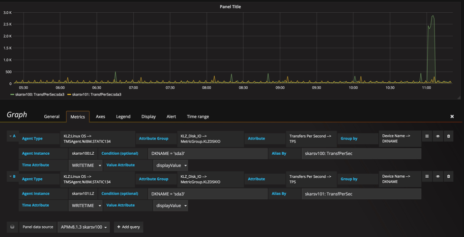

12.  We are almost done! Add a proper chart title in General tab.
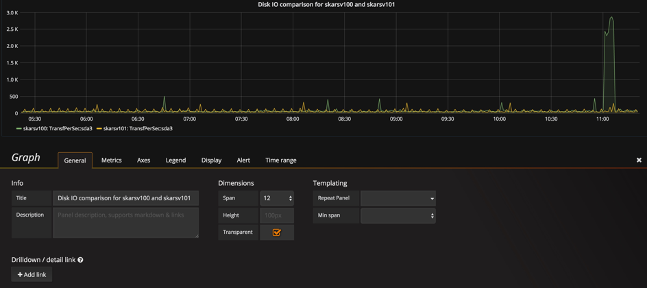
13.  Customize the legend in the Legend tab to make it look better and
    provide more useful information. Much more can be customized in the
    Display tab.
If you want to customize each data series separately, use the Display tab
and Series overrides section.
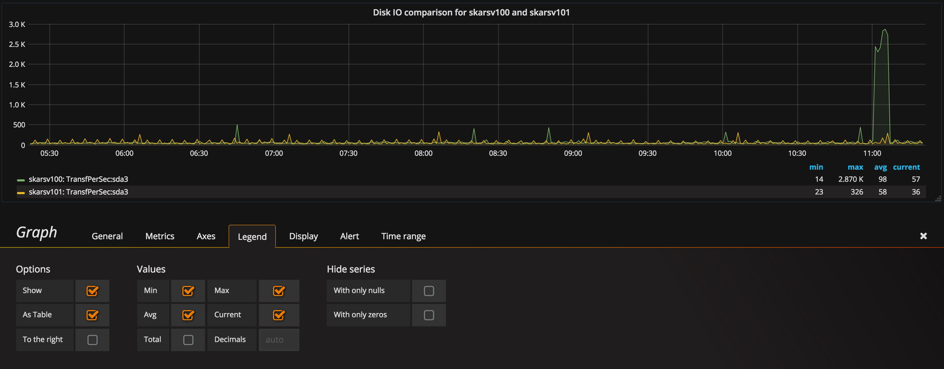
14.  The chart is completed. You can resize it if you want to include more
    panels in the row, add new rows with the new panels and so on.
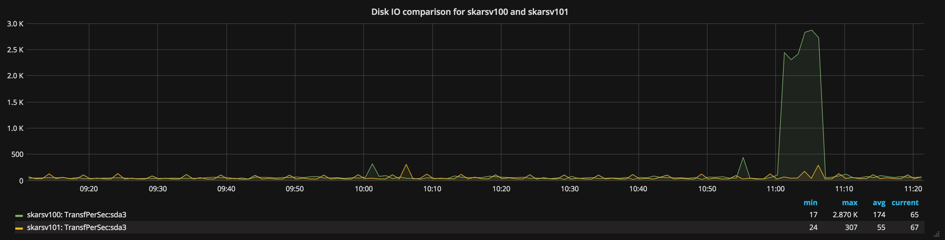

Grafana installation
====================

Follow the steps described in the Grafana documentation:
[*http://docs.grafana.org/installation/*](http://docs.grafana.org/installation/) to install Grafana.

Latest versions of APMv8 and ITMv6 do a HTTP Referer header check and reject REST API calls when Referer URL (host and port part) is different than APM or TEPS URL. Use one of the following workarounds to modify Referer header of requests coming from Grafana to APMv8 or TEPS. 

- Disable the Referer HTTP header in the browser settings. Firefox: in the about:config page, search for Network.http.sendRefererHeader and set it to 0. Chrome requires a custom extension like [Referer Control](https://chrome.google.com/webstore/detail/referer-control/hnkcfpcejkafcihlgbojoidoihckciin).

- Install Nginx and access the Grafana URL through Nginx acting as a reverse proxy.
Nginx should be configured either to clear the Referer header or set it as APM/ITM URL with port http://xxx.xxx.xxx.xxx:xxx. In the nginx.conf modify location section and set it (if Nginx is installed locally on Grafana server) to:

```
        location / {
             proxy_pass http://localhost:3000/;
             proxy_set_header Referer "";
        } 
```

Full installation and configuration process (Grafana, Nginx and IBM APM plugin) is also recorded [here](https://developer.ibm.com/apm/videos/grafana-plugin-ibm-apm-installation-import-sample-dashboards/).

IBM APM plugin installation
===========================
Latest verion of the plugin is always available on this GitHub page. It can be also installed from the Grafana plugin repository. If you upgrade from older plugin version, manually remove plugin directory, for example `/var/lib/grafana/plugins/grafana-ibm-apm` or `/var/lib/grafana/plugins/ibm-apm-datasource` and follow the installation steps below.

1).  Install the plugin using one of the following methods:

a.) Download the latest release of the IBM APM plugin from [here](https://github.com/rafal-szypulka/grafana-ibm-apm/releases) and unpack on your Grafana server in `/var/lib/grafana/plugins` directory.

b.) Simply clone the GitHub repository on your Grafana server: 

```
cd /var/lib/grafana/plugins/
git clone https://github.com/rafal-szypulka/grafana-ibm-apm

```
c.) Install the plugin using the Grafana CLI:

```
grafana-cli plugins install ibm-apm-datasource
```

2). If you are using Grafana 5.x, skip this step - Grafana 5.x allows to define a whitelist of cookies that can pass the datasource proxy and IBM APM Grafana plugin utilize this feature to deallocate datasets on ITM or APM server. 

If you are using Grafana 4.x, phe plugin requires slight modification of the Grafana 4.x server backend to properly deallocate datasets on the APM or ITM server after every metric query. For Grafana 4.x installed on Linux, replace **grafana-server** binary with the one downladed from here: 

- [RHEL 7 / CentOS 7](https://ibm.box.com/s/6sflz4wyru71vh645h311oarygwnztxc)
- [RHEL 6 / CentOS 6](https://ibm.box.com/s/356e0vsslso171qwmsoy2fylhjfhpxkk)

or modify and build it by yourself.

Here are the steps to build modified grafana-server binary:

- install Go language compiler and download Grafana sources using the steps documented [here](http://docs.grafana.org/project/building_from_source/). 
- change the file `ds_proxy.go` by commenting these two lines:

```
req.Header.Del("Cookie")
req.Header.Del("Set-Cookie")
```

- compile and build grafana-server binary using the steps documented [here](http://docs.grafana.org/project/building_from_source/) and replace the original grafana-server file with the new one.

3). Restart Grafana. On RedHat/Centos run:

`systemctl restart grafana-server`

IBM APM data source configuration
=================================

Click the Grafana Logo -&gt; Data Sources and click **+Add data source**.

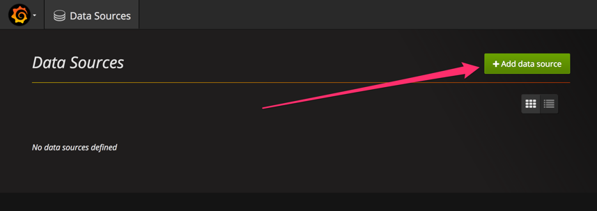

Specify the data source name and select “IBM APM” from the list.

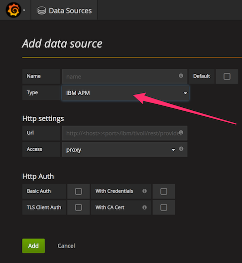

Specify the REST API URL:

-   APMv8

`http://<apm_server_hostname>:8090/ibm/tivoli/rest/providers/itm.KD8`

-   ITMv6/SCAPMv7

`http://<TEPS_server_hostname>:15200/ibm/tivoli/rest/providers/itm.<TEMS_NAME>`

**Note:** If you connect IBM APM datasource to Hub TEMS with HA configuration or `<TEMS_NAME>` contains non-alphanumeric characters, then define Domain Override in TEPS Data Provider. Check [issue #3](https://github.com/rafal-szypulka/grafana-ibm-apm/issues/3) for more details. 

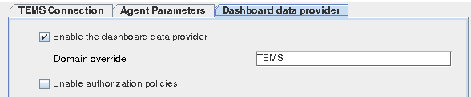

Select **Basic Auth** and **With credentials** and specify the user name

-   APMv8 – smadmin (default password apmpass)
-   ITMv6/SCAPMv7 sysadmin (password for ITM sysadmin user)

Select checkbox "Deallocate dataset after every metric query". It is recommended to have it enabled all the time. Lack of datasource deallocation requests may cause memory leak and OutOfMemory exceptions on APM or ITM server. Disable this option only for testing a new panel query, if you want to use Grafana Query Inspector feature.

The Screen below illustrates the completed configuration for the APMv8 data source:

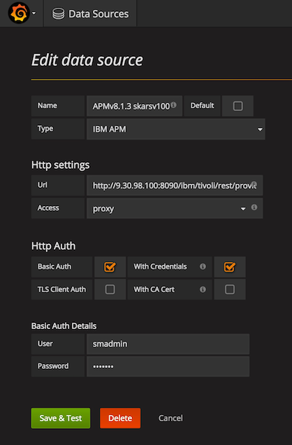{

Click **Save & Test**. If the connection is successful, you should see the following
message:

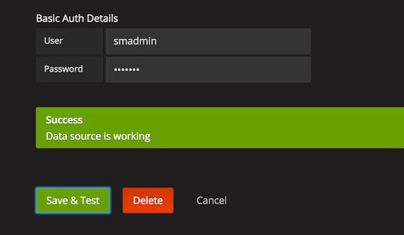

Configuration for ITMv6/SCAPMv7:

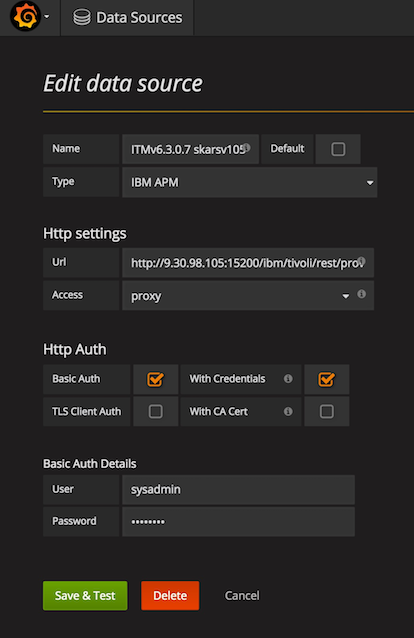

Click Cancel to exit. Now both data sources are configured.

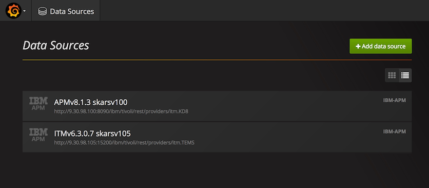

Templating
==========

The IBM APM plugin for Grafana supports the basic templating feature. Check the example dashboard:

[*http://169.44.6.110/dashboard/db/linux-os-dashboard-ibm-performance-management-8-1-3?refresh=30s&orgId=1*](http://169.44.6.110/dashboard/db/linux-os-dashboard-ibm-performance-management-8-1-3?refresh=30s&orgId=1)

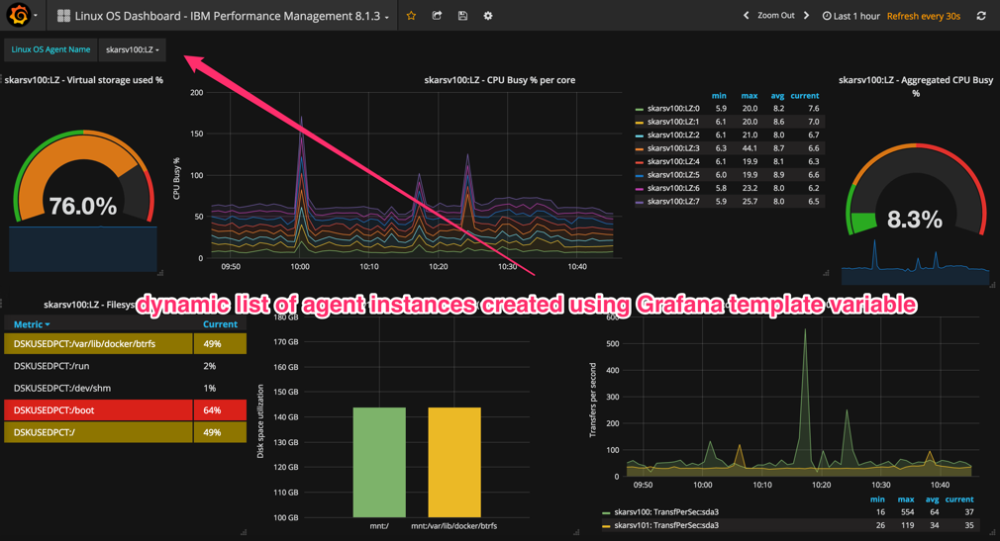

The agent instances list (dynamic and searchable!) in the upper left corner
was created using Grafana template variable. When you select another
agent instance, all the panels are updated with data from another agent
instance.

**How to set it up step by step:**

1.  Create the template variable. Click
     **Manage dashboards** > **Templating**, then click the **+New**

2.  Specify the template settings as shown in the picture below:

Variable name **AgentName** will be used in a panel query as **$AgentName** and will
be substituted during query execution by the current option selected
from the upper-left corner list. Select your APM Data Source and specify
agent type in the Query.

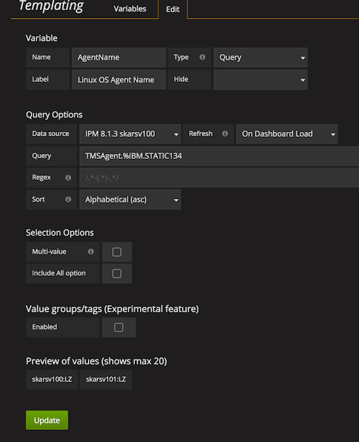

Agent Type in the Query field should be specified in an obscure form of the
APM REST API datasource id (it may be improved in a future
version of the plugin). For example, for Linux OS Agent it is **TMSAgent.%IBM.STATIC134**.

Datasource IDs can be listed using APM REST API test tool via HTTP GET
request of the following URL:

/ibm/tivoli/rest/providers/itm.KD8/datasources for APMv8 or
/ibm/tivoli/rest/providers/itm.&lt;TEMS\_name&gt;/datasources for
ITMv6/SCAPMv7.

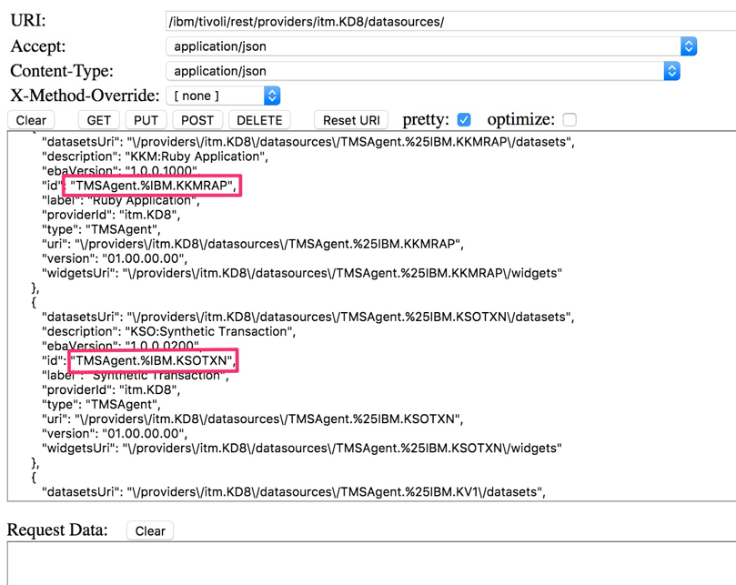

Troubleshooting
===============

1). IBM APM plugin for Grafana does not currently support Grafana Alerting feature.

2). If you configured your new panel and do not see the data, use the 
Chrome developer tools or Firefox Firebug and check the console – you should
see an error message there. For example, if there is a syntax error in the **condition** field, the REST API will return status code 500 and the error message will be logged in the javascript console.


3). The ITM REST API does not provide data
for **every** attribute. The plugin tries to filter out Attribute Groups not
available in the APM prefetch database, but even if the specific attribute group
is collected in prefetch, it could be that specific attribute is not
provided by the REST API. Use the Chrome developer tools (network tab) or
Firefox Firebug to see what requests are made to the REST API, copy it
and test in the APM REST API test tool:

APMv8: http://\<apm\_server\_hostname\>:8090/ITMRESTProvider/test.html

ITM6/SACAPM7: http://\<TEPS\_server\_hostname\>:15200/ITMRESTPrivider/test.html


Example request:

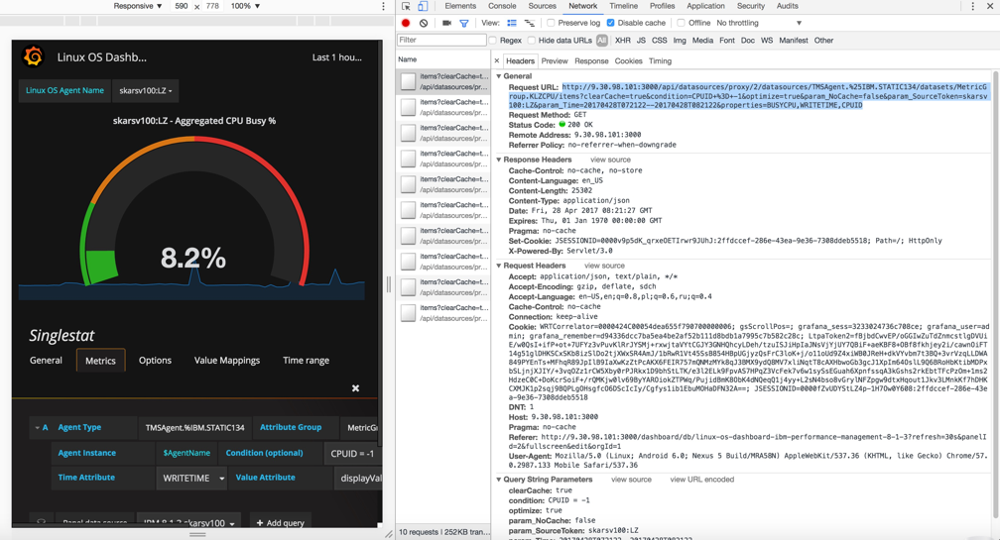

Example response:

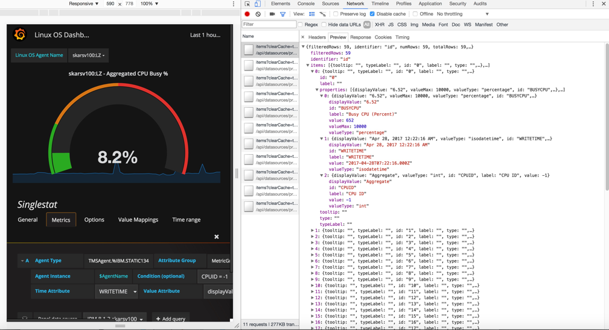

The same request in the APM REST API test tool:

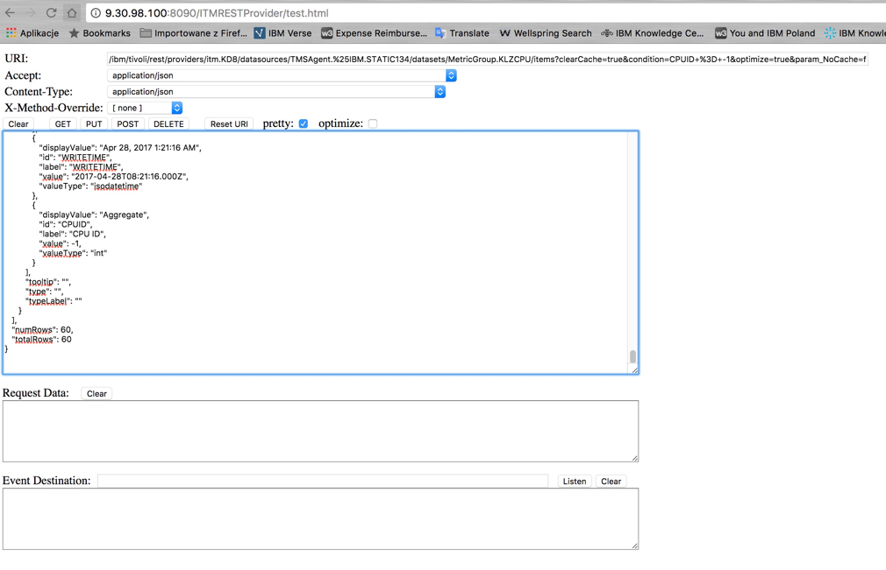

Note the difference in the request URL done from your browser to Grafana:

**169.44.6.110/api/datasources/proxy/2**/datasources/TMSAgent.%25IBM.STATIC134/datasets/MetricGroup.KLZCPU/items?clearCache=true&condition=CPUID+%3D+-1&optimize=true&param\_NoCache=false&param\_SourceToken=skarsv100:LZ&param\_Time=20170428T072122--20170428T082122&properties=BUSYCPU,WRITETIME,CPUID

Grafana proxies API requests, so the actual APM REST API call is done not from
your browser client, but from the Grafana server to the APM server.

To test the same request in the APM REST API test tool change it to:

**/ibm/tivoli/rest/providers/itm.KD8**/datasources/TMSAgent.%25IBM.STATIC134/datasets/MetricGroup.KLZCPU/items?clearCache=true&condition=CPUID+%3D+-1&optimize=true&param\_NoCache=false&param\_SourceToken=skarsv100:LZ&param\_Time=20170428T072122--20170428T082122&properties=BUSYCPU,WRITETIME,CPUID

4). If the REST API rejects requests from Grafana because of wrong HTTP referer header, use one of the proposed workarounds described in the installation chapter.

5). [ITMv6] If the historical collection is not enabled for attribute group specified in the panel query then, by default the similar error will be logged in the bowser console:

```
{"message":"IPM Error: undefined","data" {"msgId":"ATKRST100E","stackTrace":
"com.ibm.usmi.console.navigator.model.NavException: 
(ATKRST100E) ATKRST100E An unexpected error occured. 
The error message is as follows: 'KFWITM217E Request error: SQL1_OpenRequest failed 
rc=3000\n'.: nested exception is: 
\n\tcom.ibm.tivoli.monitoring.provider.navmodel.ITMRuntimeException:
 KFWITM217E Request error: SQL1_OpenRequest failed rc=3000\n\r\n\tat
 (...)
```
Enable historical collection for the following Attribute Groups, 
if you are going to import [sample dashboard for ITMv6 Linux OS Agents](https://github.com/rafal-szypulka/grafana-ibm-apm/blob/master/Example_dashboards/Linux%20OS%20Dashboard%20-%20IBM%20Tivoli%20Monitoring%206.3.0.7-1493380888346.json):

- KLZ CPU
- KLZ Disk
- KLZ Disk IO
- KLZ Network
- KLZ System Statistics
- KLZ VM Stats

Attributes from attribute groups not enabled for historical collection can be displayed in singlestat and table panels if the option **Time Range** is set to *Current value* in the panel query editor.